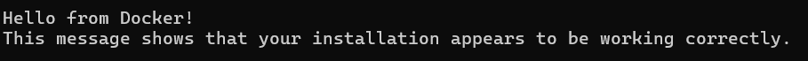

#  Razor Pages Book Catalog

Веб-застосунок для керування каталогом книг, побудований на базі ASP.NET Core. Проєкт реалізований з фокусом на архітектурну чистоту та стійкість до збоїв (resilience).

##  Функціонал
- **Каталог книг:** Перегляд, додавання та редагування інформації про книги.
- **Обробка медіа:** Завантаження обкладинок (jpg/png/webp).
- **Resilience:** Реалізовано стратегії Retry, Exponential Backoff та Idempotency для критичних операцій.

---

## 🏗 Архітектура та Resilience

Згідно з ADR 0004, у проєкті впроваджено наступні механізми стійкості:
- **Idempotency:** POST-запити на створення книг використовують `Idempotency-Key` для запобігання дублікатів.
- **Retries & Backoff:** Клієнтський JavaScript автоматично повторює запити при помилках 5xx або 429 з експоненційною затримкою.
- **Timeout:** Усі запити мають таймаут 1 секунду через `AbortController`.
- **Degraded Mode:** При стабільному перевантаженні сервера UI блокує кнопки та показує інформаційний банер.

---

## 📡 API Документація

Проєкт надає стандартизований REST API.

* **Специфікація:** [openapi.yaml](RazorPagesBook/docs/api/openapi.yaml)
* **Стандарт:** OpenAPI 3.0.3

### Візуалізація Swagger
Нижче наведено інтерфейс документації, що описує всі ендпоїнти, включаючи перевірку стану системи (`/health`):

---

Для перевірки докера було відкрито командний рядок та вписано команду docker run hello-world, після чого крмандеий рядок показав такий результат:

---
## Технологічний стек
- Backend: .NET 8.0 (Razor Pages)
- Frontend: HTML5, CSS3, JavaScript (Fetch API)
- Database: Entity Framework Core
- API: OpenAPI / Swagger
